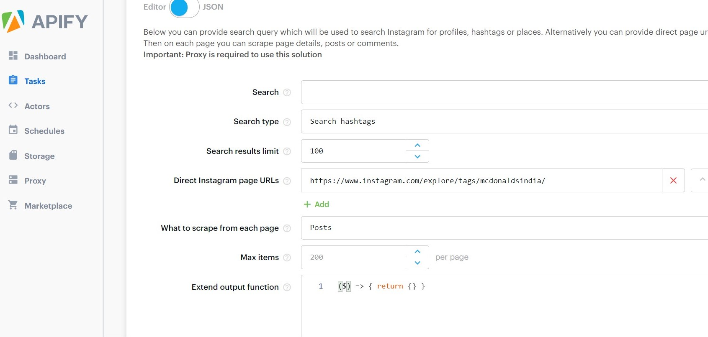
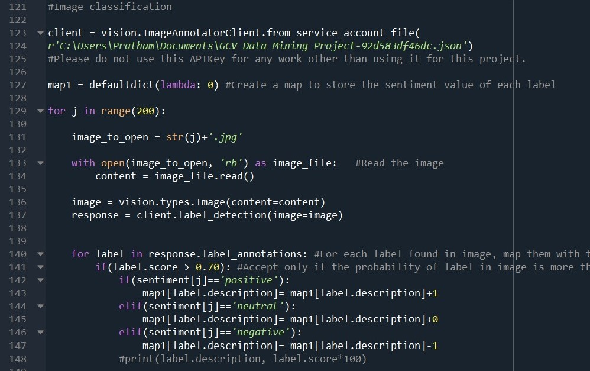
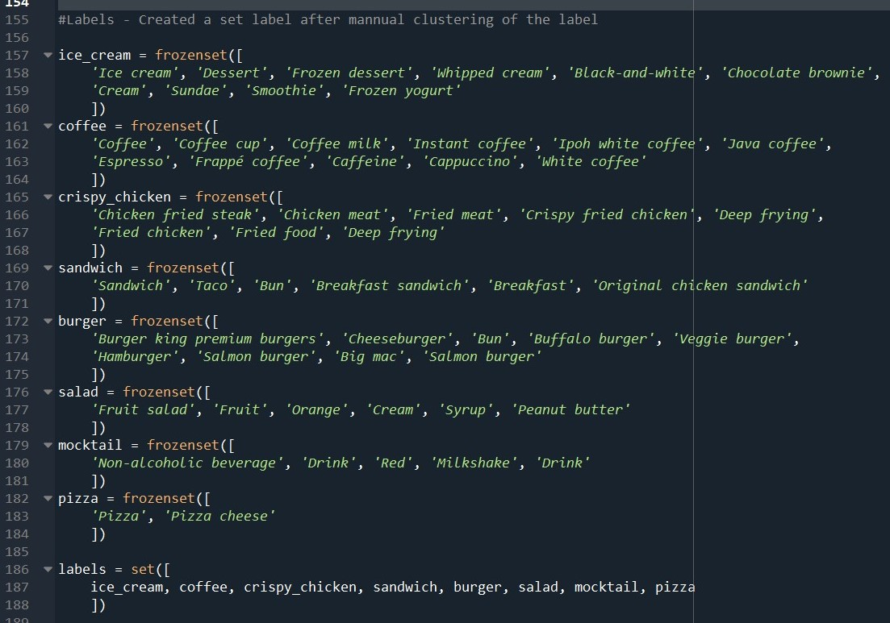

<h2 align="center">Brand-Imaging using mining of Brand-related User Generated content on Social Networking Services using Textual and Visual data inputs </h1>

<h3 align="center"> Abstract </h3>

 This paper revolves around the approach to interpret data from Hashtags, Captions and Images of Social Networking Services to study brand related user generated content in order to gather insights of performance of brand related products using technologies involving emotion-sensing, image-classifcation, Label-clustering and mathematical indexing of output based on satisfaction levels of dierent products. product from images is combined with the sentiment calculated from hashtags and captions to and the satisfaction level of various products that the brand wishes to know the performance of. 

## Problem Statement 

Brand Imaging through emotion-sensing and Integration of Textual and Image content of Brand-Related User-generated data on Social Networking Services.

## Proposed Methodology

- We can see that Social Networking Services (SNS) are often flooded with Brand Related User Generated content, SNS has also come up to be a platform for Grievance sharing and redressal and therefore mixed views on all products are coming up giving a fair share of representation to all kinds of ideologies

- We use this opportunity to find all relevant posts in a given timeframe from Instagram through relevant hashtags making direct association with the brand, for example in our program we use hashtags like #McD and #McDonaldsIndia and scrap most recent posts with these hashtags. The posts are scrapped using my.apify.com

- We then store the Caption, Image, and Hashtags separately to be analyzed together. 

- As explained in the Literature survey about captions presenting the true emotion of statements in given posts, we run dynamic emotional sensing on the caption by finding all hot and relevant keywords. The generated emotion is categorized in polarity points of Positive Neutral and Negative.

- Once the sentiment pertaining to all the captions has been found out we set on to the next task that is classification and clustering of different labels that the image carries. We run our model to find all the relevant labels that the image contains. We make a broad set of Labels or the main labels that are actually the products on which the brand wants image interpretation, for example in this we have found out all associated labels to main labels like Ice Cream, Crispy Chicken, Coffee, Sandwich, Burger, Salad, mocktail, and Pizza. There are a plethora of association labels that are excavated from the image classification and then clustered or mapped to the relevant label as given.

- Once the labels have been identified, we project those labels to the field that contains the actual sentiment value associated to the post containing the image from which the labels have been dug out. The labels are then given the index score of Positive, Neutral, or Negative as ascertained from the captions. 

- Once the mapping is complete we find the aggregate resultant of all the labels and posts that were taken as input. The aggregate result through statistical measure is then attributed to map whether the public sentiment relating to the specific target label is positive and what is the associated confidence of the particular product.  

- The final result is shown in a tabulated form with all intermediary and final outputs including positive cases, negative cases, etc. This is further made more visually appealing by fixing the color gradient with respect to the confidence generated.  

## Hardware and Software Requirements

**Hardware** - Computer System, GPU.
 
**Libraries Used** - Pandas, re, string, NumPy, textblob, preprocessor, nltk, stopwords, vaderSentiment, google.cloud, google.cloud.vision, urllib.request
 
**API Required** - Google Cloud Vision API
 
**Software** - Spyder (Python 3.7), Anaconda Enviroment.
 

## Results

As explained in the proposed methodology about the various tasks that have been in fact taken to generate the desired output of Brand imaging by product satisfaction levels of different products (8, in this case) for the brand McDonald’s. We present a therefore result set for the progress to share the way the final results have been derived in a step by step process:

 
1. In the Fig 1, we can see that this is the window of the APIFY software that we used to scrap relevant posts with required hashtags. Here we are inputting the Tag, the number of photos we want to scrap off, and then we give it a go to get the desired set of results.
 
 

 
2. In the Fig 2 we can see that post the scrapping has been done we have stored the scrapped content in a form where all the captions, Hashtags of the post, Comments on the post and the URL of the image has been stored. This data is then used in sentiment analysis.
 
 

 
3. While in earlier image we saw the image URLs were given, the Image in actuality has been stored in the local drive (as shown in Fig 3), of the workstation where all photos have been sequentially stored for performing the Image label detection.
 
 

 
4. From Fig 2, we used the data in that form and performed the sentiment analysis on the caption that included the emojis and all hot-keywords to detect the emotion as shown in in Fig 4.The sentiments have been stored in as Positive Negative or Neutral.
 
 

 
5. While the Sentiments have been recorded we go on to read the labels of the image and use the model involving Google cloud vision to detect the labels and store the count of each as shown in fig 5.
 
 

 
6. While the sentiments were given in textual format of Positive, Negative and Neutral we used the code as shown in snippet in Fig 6 to allot numeric values of +1, 0, -1 as per the sentiment recorded post emotion sensing.
 
 

 
7. As earlier explained in the proposed methodology we have used label clustering from the image to point on some labels that actually relate to specific products. For example P1 Product has L1,L2...Ln labels. Some examples of these labels and corresponding Main products have been shown in Fig 7.
 
 

 
8. The entire process has been made to generate the final result that is displayed in the Fig 8.The Result includes index number of the product similar to the product code and has been sorted on the basis of Satisfaction level. The Result has been made visually appealing by using color gradient to show the confidence level or Positivity index of a product. Currently for clarity we are also showing exactly how many positive negative and neutral values are given so as to know how dense is the penetration of the product in the mass.
 
 

## Conclusion 

The project can have a far reaching business model applicability and can even be used in multiple socio-political and socio-economic domains to analyse and view the way society is reacting towards any incoming change as SNS are serving as the platform where ideas are being critically discussed and analyzed by all the people of society alike. In the current scenario as we can see the data set taken in consideration was of around 200 recent images posted on instagram it can be further extended to collect data on a regular interval to serve real time data availability and can therefore be a tool of real time actions and governance for management of a company with the major emphasis on reaction from the general public or End users. The project employs the use of multiple technologies like Image classification, Web Scraping, Emotional sensing and a lot more of normal machine learning tools. This project also aims to create a methodology inspired by an Expert system where we have kept the module like a knowledge engine and with minimal modifications and input parameter changes the same can be extended for different companies and different usage. With adequate usage of new technologies and creation of a proper business usable project, we feel that the project can be extended to multiple domains and serve the purposes of a good business software that can be a tool for Data scientists to examine underlying viewpoints of all class of society with respect to a brand and its products.

